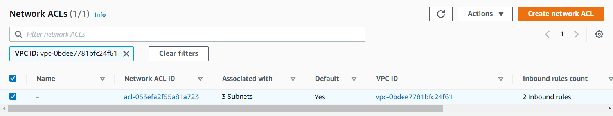

# The Workshop

## Create the VPC


When we go to the VPC page, either by searching in the _Search Bar_, or clicking on a shortcut that might be in one of the widgets, we're presented with the landing page for VPC management.


There are two things to note about this page as is.  Firstly, as the _region_ set to `eu-west-1`, a.k.a. _Ireland_ we're seeing VPCs for the European region.  Secondly, even though this is a virgin account, there are quite a few resources already created.  

| Resource         |  Count  |
|------------------|:-------:|
| VPC              |   `1`   |
| Subnet           |   `3`   |
| Route Table      |   `1`   |
| Internet Gateway |   `1`   |
| DHCP Option Set  |   `1`   |
| Network ACL      |   `1`   |
| Security Groups  |   `1`   |

AWS creates these to get you started.  It could take you a while to create these, and if all you want is to instantiate some EC2s then these give you a working, low security, low complexity infrastructure for you to do that.  They're not suitable for non-trivial situations though.


## Our Goal

We're going to create a VPC, two subnets.

* VPC
  * Private Subnet
  * Public Subnet

Each subnet will contain an EC2 instance.  We'll configure the necessary components so that we can perform operations on both EC2 instances whilst controlling access to the private instance.

## Creating a VPC

Clicking on _Create VPC_ will take us to the starting page for configuring a new VPC.


> AWS has rolled out a new console.  We now have the option to configure al ot of the sundry services in the same workflow.  We can choose whether we want to do this by selecting on appropriate option in the _Resources to create_ section.
> 
> Selecting the _VPC and more_ option gives us a really useful visualisation of what we're creating.  For the sake of this exercise we will create resources individually.

Select the _VPC Only_ option.

Enter the [CIDR](cidr-notation.md) for the subnet.  We have a few things to consider when decide on the CIDR:

1. Base address
2. Size

As we have no other VPCs the base address is free for us to choose.
The size doesn't need to be big, but it does need to be big enough for us to:

1. Create 2 subnets
2. Account for reserved IP addresses
3. Create 1 EC2 instance per subnet.

Each subnet has five IP addresses that are unavailable for general use:

| Address     | Purpose                       |
|:------------|:------------------------------|
| `x.y.z.0`   | Network Address               |
| `x.y.z.1`   | Reserved for VPC router       |
| `x.y.z.2`   | Reserved for DNS server       |
| `x.y.z.3`   | Reserved for AWS internal use |
| `x.y.z.255` | Network broadcast             |

We need a minimum of twelve addresses.  As the size is a power of two, the smallest size we can have is sixteen.

```text
10.0.0.0/28
```

Unfortunately, the minimum size for a subnet is `/24`, so to have two subnets we need at least `/23`.

```text
10.0.0.0/23
```


### Creating the subnets

Click on the subnets option on the menu on the left.


This well show us a list of the subnets we have in this region.


Notice that there's already some there.  These are part of the default subnet.  We need to click on _Create subnet_.

We'll need to work out what the address ranges we're going to give to each of out subnets.  We want half each so that works our as:

|          CIDR | Name                |
|--------------:|:--------------------|
| `10.0.0.0/24` | `my-public-subnet`  |
| `10.0.1.0/24` | `my-private-subnet` |


During the process of creation process we'll also be asked what _Availability Zone_ (a.k.a. _AZ_) we want the subnet to be in.  A VPC exists in a _Region_ and spans multiple AZs however a subnet exists in a single AZ (within the _Region_ of its VPC).  We're able to specify an AZ or just say that we don't care.

Once the subnets are created we can see them back on the summary page, if we filter on the VPC then we can limit to the subnets we just created.


### Network Access Control Lists

WHen we created our VPC a network control list was automatically created and then associated with teh two subnets we created.  Clicking on _Network ACLs_ menu item we can see the NACLs in the region.


This will take is to a summary screen, showing all the subnets for all VPCs.  We can filter this for out VPC.



Because we will have both a private and a public subnet we will need a different NACL for each subnet.

Right now the subnets are both open to the World.  To see this let's create an EC2 in each subnet, set up a simple webserver and confirm that we can access it from the internet.

## EC2

EC2 are AWS virtual machines.  EC2s are instantiated into a single subnet and consist of a computational component and one or more storage components.  We need to move to the EC2 home screen in order to instantiate EC2s.


If we click on the _Launch Instance_ button then we're taken to the page that allows us to define the instance we want to launch and finally launch it.


After giving the EC2 a name we move onto the more advanced configuration options.

### Instance Type & OS

There are a large number of instance types, each with differing target use-case. Most are chargeable, however there is a small number of _Free tier eligible_ types, one of which is `t2.micro` which is probably the type already selected (this instance type isn't available in all regions, however there will be a similar size instance type on the free tier of those regions). 

We can also select the OS, again, some OSs are chargeable.  _Amazon Linux_ is a Linux based OS developed specifically for use on EC2 instances and is free to use.

### Key Pairs and SSH

In order to SSH into out EC2 we need to generate a Key Pair.  We have to use a different form to generate a Key Pair.  We can either navigate to it from the menu on the left (but that would navigate us away from the page, and so we'd lose our work so far) or we can click the _Generate Key Pair_ button in the _Key Pair (login)_ section.

 Section")


Clicking on the _Create Key Pair_ button we get a simple form which will allow us to generate the pair and download the corresponding file.


There are two encryption methods offered:

1. RSA
2. ED25519

RSA is widely supported and secure (for key size `> 2048`).
ED25519 is not supported by Windows, it is secure and is reported as faster than RSA.

If you want to use Windows then you must use RSA, otherwise you should prefer ED25519.

We also have two options for the private key file for use to download.  PEM is supported by OpenSSH (which is available on Linux), PPK is supported by PuTTY, which is a well-used Windows client.  There are methods to convert between the two file types in the case that we need to connect from Windows and Linux clients.  I'm using PuTTY, so I'll use the PEM.  Clicking _Create_ will cause the private key to be downloaded to your browser's download location.

### Network Settings

We need to select the VPC and the subnet that the EC2 will be launched into, as well as create a security group to control access to the EC2.


The network settings allow us to create the security group with some common ports open.  If we wanted less common ports opened then we can use the _Security Groups_ menu link.


In order to see how to create SGs we'll create one outside this form and come back to it.

The form will also ask us whether we want to create a public IP for the EC2.  

## Security Groups


Clicking on _Create Security Group_.


We name our group, optionally give it a description, declare the VPC that it'll be available in, and then we can define our _Inbound_ and _Outbound_ rules.

Whilst we could create one group to allow both the SSH connection and the HTTP traffic we'll actually create two so that we can add and remove them later on.

| SG Name           | Direction | Type  | Port  | Source      | 
|-------------------|-----------|-------|-------|-------------|
| my-webserver      | Inbound   | HTTP  | `80`  | `0.0.0.0/0` |
| my-webserver      | Inbound   | HTTPS | `443` | `0.0.0.0/0` |
| my-ssh-connection | Inbound   | SSH   | `22`  | `0.0.0.0/0` |

One these are created we can see that there are three SGs associated with our VPC.


### EC2 (continued)


We'll add the two SGs that we created just now, we'll also make sure tha the VPC is our new VPC and that the subnet is our designated public subnet and that we have a public IP set.

Next we're asked about what storage options we want.  All Ec2 instances need some form on block storage to run the OS and other applications on.  When this storage is tied to a single instance it's called _Instance Storage_.  Instance storage is ephemeral, in that if the instance is terminated, the storage will also be terminated and it's data irrecoverably deleted.

There are also several _[volume types](https://docs.aws.amazon.com/AWSEC2/latest/UserGuide/ebs-volume-types.html)_.  `gp` is _General Purpose_, other types are available for more specialised use-cases.

We'll pick `gp2`.

### Advanced Details

There's a swathe of options here that are mostly beyond the scope of this.  The _User Data_ field at the bottom is worthy of mention though.  This is a script to be run immediately after the instance is instantiated.  Amongst other things, it can be used run an initial `yum update` and/or install any applications and configure them.  This is going to be a web server, so we'll add a script to create and configure a web server here.  User data needs to be base64 encoded, however if we enter it in the UI here the encoding will be done for us.  We'll add this:

```shell
#!/bin/bash
sudo su
yum update -y
yum install httpd -y
echo '<!DOCTYPE html>' > foo.html
echo '<html>' >> foo.html
echo '<head>' >> foo.html
echo '    <title>My Public WebServer</title>' >> foo.html
echo '</head>' >> foo.html
echo '<body>' >> foo.html
echo '<h1>Hey.  You found the Web Server.</h1>' >> foo.html
echo '</body>' >> foo.html
echo '</html>' >> foo.html
```

### Launch it

Finally, now if we click launch we'll see the instance appear in the list of instances in the summary page.  Watch the _Instance State_ column to see when it reached _Running_.


## The Public Subnet  

Initially our public subnet will hold an EC2 instance which will operate as a webserver.  We're also going to be accessing this over SSL, so we will need to allow traffic on port `80` and 


---
# TO DO:

* NAT, IGW
* ACL, NACL
